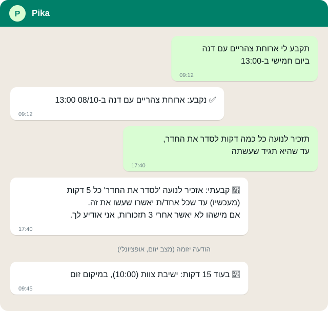
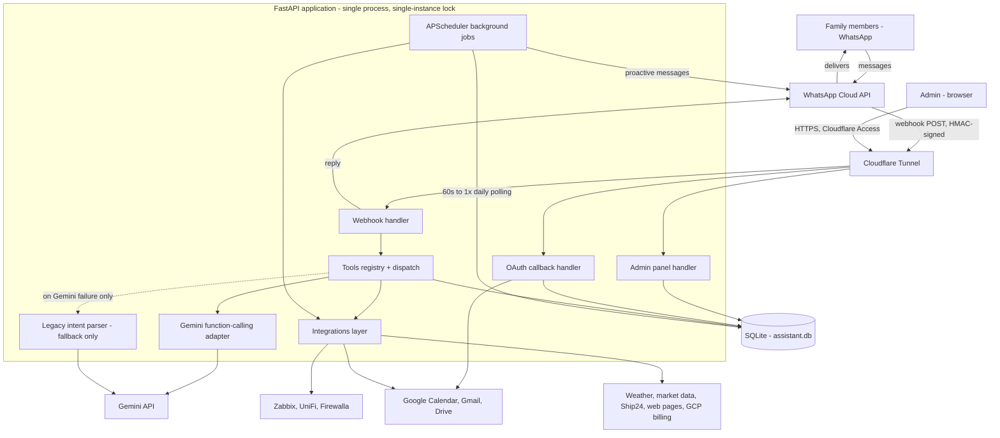

# Pika — a personal WhatsApp assistant

[](https://github.com/marikbrest/pika-personal-whatsapp-bot/actions/workflows/tests.yml)
[](./LICENSE)

Pika is a self-hosted assistant for you and your family that lives entirely inside
WhatsApp. Message it (text or voice; Hebrew-first, understands English) and it handles reminders, Google
Calendar, Gmail, weather and market prices — and, if you opt in, it watches your calendar
and inbox in the background and only interrupts you when something is genuinely worth it.

Everything runs on your own machine: one FastAPI process, one SQLite file, your own
Meta/Google/Gemini credentials. No SaaS in the middle, nothing to sign up for.

## What it can do

<p align="center"></p>

<p align="center"><sub>Illustrative example — the reply wording is taken from the bot's real response formats; names and times are made up.</sub></p>

Just write to it in plain language (Hebrew or English, text or voice). Examples:

**Reminders & tasks**
- *"Remind me tomorrow at 9 to call the doctor"* — one-off, daily or weekly; snooze, move, edit, cancel.
- *"Remind Danny every evening to take out the trash"* — reminders for family members and contacts.
- *"Nag the kids every 5 minutes until they confirm homework is done"* — persistent reminders that escalate to a parent if ignored.
- *"Add milk to the shopping list"*, *"what's on my list"* — shopping and to-do lists.
- Kids' weekly timetable: *"Noa has math on Monday"* → a reminder every evening about tomorrow; the kid can ask too.

**Google Calendar, Gmail & Drive** (nothing is ever sent without your approval)
- *"What meetings do I have today"*, *"schedule lunch with Dana on Thursday at 1"* — checks conflicts, invites family members who use the bot.
- *"Any unread email?"*, *"summarize that thread and list the deadlines"*, *"which emails am I still waiting on?"*, *"draft a reply saying yes"* — drafts are shown to you before anything is sent.
- *"Save this note to Drive"*, *"find the lease PDF"*.
- *"Send me my meetings every morning at 8"* — an automatic daily summary.

**Proactive mode** (opt-in, off by default)
- Watches your calendar and inbox and only interrupts you for things that matter: a moved or cancelled meeting, a bill deadline, a shipment, an urgent email from a VIP, a briefing before each meeting.
- You stay in control: quiet hours, a daily cap, a VIP list, *"I'm in a meeting until 4"*, and held-for-later digests.

**Look things up**
- *"What's the weather this week in Haifa"*, *"how much is Bitcoin"*, *"Apple's price"*.
- *"What happened with X today?"* — answers from a live web search, not from memory.
- *"Where's my package?"* — tracking numbers, with updates when status changes.
- *"Tell me when this page changes"* / *"tell me when she replies to that email"* — change watches.
- *"Give me a morning brief"* — weather, calendar and unread mail in one message.

**Memory & knowledge**
- *"Remember that Noa is allergic to peanuts"* — explicit, user-controlled long-term facts.
- *"Save this link"* — keeps a permanent copy; *"what did we say about the trip?"* searches your past chats and saved links by meaning.

**Images & documents**
- Send a photo, screenshot or PDF and ask about it, or have it act on it (e.g. a photo of a school timetable becomes the kid's saved weekly schedule).
- *"Draw a cat in space"*, *"make this photo black and white"*.

**Admin, privacy & cost**
- Multi-user with strict isolation; the admin dashboard shows counts, never message content, and every admin view is audit-logged. *"Can the admin see my messages?"* gets an accurate, code-grounded answer; *"show/delete my data"* works.
- *"How much have I spent?"* — a usage report, a periodic cost report and a budget alert (owner only).
- *"What can you do?"* lists capabilities; *"tell the developer I want X"* forwards a feature request.
- Optional home-lab status (Zabbix, UniFi, Firewalla) — see [Optional add-ons](#optional-add-ons-home-lab-integrations).

Everything is covered by 900+ tests that run with no credentials or network.

📄 Design background: [PRD.md](./PRD.md)

## What you need

| Requirement | Notes |
| --- | --- |
| Python 3.12+ (CI tests 3.12, 3.13 and 3.14) | any OS; Windows scripts are provided, Linux/macOS notes below |
| A WhatsApp Business Cloud API app | free Meta developer account; a test number works to start |
| A Gemini API key | [Google AI Studio](https://aistudio.google.com/) — a project **with billing enabled** if you connect Gmail/Calendar/Drive or serve other people (the free tier lets Google use submitted content to improve its products; see [Terms & privacy](./docs/TERMS_TEMPLATE.md)) |
| A Google Cloud OAuth client | only for Calendar/Gmail/Drive features |
| A public HTTPS URL pointing at the bot | Cloudflare Tunnel (free) is what this project uses |

Typical running cost is a few dollars a month of Gemini usage for a small family — see [docs/COSTS.md](./docs/COSTS.md) for real numbers.

## Architecture

Single FastAPI process (see [`src/main.py`](./src/main.py)) behind a Cloudflare Tunnel,
with proactive jobs running in-process via APScheduler rather than a separate worker or
message queue. One SQLite file is the only datastore. Real function-calling against
Gemini (see [`src/tools/`](./src/tools)) is the primary classification path; the older
prompt-based classifier ([`src/intent_parser.py`](./src/intent_parser.py)) stays wired
in purely as a fallback for a genuine Gemini API failure on the tools call, not because
any intent still lacks a tools equivalent.



A full file-tree view of the repo (auto-generated on every push to `main`) lives at
[`design/repo-diagram.svg`](./design/repo-diagram.svg).

## Try it in 2 minutes (no WhatsApp needed)

All you need is a Gemini key. The sandbox runs the real message pipeline in your terminal:

```bash
pip install -r requirements.txt
echo "GEMINI_API_KEY=your-key" > .env
python scripts/chat.py
you> remind me tomorrow at 9 to call the doctor
```

<p align="center"></p>

<p align="center"><sub>A real <code>scripts/chat.py</code> session against Gemini (output recorded as-is, then animated). Note that replies the code composes itself are still Hebrew even for English input — <a href="https://github.com/marikbrest/pika-personal-whatsapp-bot/issues/1">help wanted</a>.</sub></p>

It uses a throwaway database and prints what the bot *would* have sent over WhatsApp.
(Calendar/Gmail/Drive need a real Google OAuth setup and are unavailable here.)
With Docker: `docker compose run --rm bot python scripts/chat.py`.

## Quick setup

```bash
git clone https://github.com/marikbrest/pika-personal-whatsapp-bot.git
cd pika-personal-whatsapp-bot
python -m venv venv
venv\Scripts\activate          # Windows   (Linux/macOS: source venv/bin/activate)
pip install -r requirements.txt
cp .env.example .env            # Windows: copy .env.example .env  - then fill it in
```

1. **WhatsApp**: in [Meta for Developers](https://developers.facebook.com/) create an app
   with the WhatsApp product. Put the access token, phone-number ID and app secret in
   `.env`, pick any random `WHATSAPP_WEBHOOK_VERIFY_TOKEN`, and set the webhook URL to
   `https://<your-domain>/webhook` (subscribe to `messages`).
2. **Gemini**: put your key in `GEMINI_API_KEY`.
3. **Encryption key**: generate `TOKEN_ENCRYPTION_KEY` (command in `.env.example`).
4. **Google** (optional, for Calendar/Gmail): create an OAuth client, add
   `https://<your-domain>/oauth/callback` as a redirect URI — see the gotcha below.
5. **Create the first admin** (users can only be added by an existing admin, so the first
   one is created from the command line):
   ```bash
   python scripts/create_admin.py 972501234567 "Your Name"
   ```
6. **Run it** (next section), then message your WhatsApp number. Say *"add user: Mom,
   0501234567"* to let family in.

New to Meta's side? Follow the step-by-step [WhatsApp setup guide](./docs/SETUP_META.md). Verify everything with `python scripts/doctor.py --online --url https://<your-domain>`. See section 7 of [PRD.md](./PRD.md) for Cloudflare Tunnel details.

### Run with Docker (any OS)

No Python setup needed:

```bash
cp .env.example .env                 # fill it in (see steps above)
docker compose up -d --build
docker compose run --rm bot python scripts/create_admin.py 972501234567 "Your Name"
```

The bot listens on `127.0.0.1:8000`; data lives in the `pika-data` volume. The container runs as an unprivileged user (UID 10001) with a built-in health check; if you bind-mount a host folder instead of the volume, `chown -R 10001` it. For a public
HTTPS URL, create a Cloudflare Tunnel, put its token in `CLOUDFLARE_TUNNEL_TOKEN`, route it
to `http://bot:8000`, and run `docker compose --profile tunnel up -d`.

### WhatsApp message templates

WhatsApp only lets a business message someone first (reminders, alerts, proactive
updates) with a **pre-approved template** once the user's 24-hour chat window has closed.
Create these in WhatsApp Manager (category *Utility*, any language; set
`WHATSAPP_TEMPLATE_LANGUAGE` in `.env` to the language you created them in, default `he`). Wording is yours; only the **number of `{{n}}`
parameters** must match:

| Template name | Parameters | Used for |
| --- | --- | --- |
| `reminder_notification` | 1 — the reminder text | reminders outside the 24h window |
| `package_status_update` | 3 — label, old status, new status | package tracking |
| `google_reconnect_needed` | 1 — the reconnect link | Google token expired |
| `proactive_update` | 1 — the update text | proactive mode outside the 24h window |

Meta may reclassify a template as *Marketing* if the wording looks promotional — keep the
text plainly transactional ("update about your calendar: {{1}}") and appeal via
Business Support if it happens. Until a template is approved, sends inside the 24-hour
window still work; only out-of-window sends fail.

### Proactive mode

Off by default, enabled per user from chat: *"turn on proactive mode"*. Related commands:
*"quiet hours 22:30 to 07:00"*, *"max 5 updates a day"*, *"I'm in a meeting until 16:00"*,
*"add boss@example.com to my VIP list"*, *"brief me 10 minutes before meetings"*. Calendar
and email content is sent to Gemini for classification/wording only; see
[Multi-user support and privacy](#multi-user-support-and-privacy).

### Helper scripts

| Script | Purpose |
| --- | --- |
| `scripts/chat.py` | talk to the bot from the terminal, no WhatsApp/Meta |
| `scripts/doctor.py [--online] [--url URL]` | checks `.env`, keys, DB, Gemini/WhatsApp tokens and the public webhook handshake, and says what to fix |
| `scripts/create_admin.py <number> "<name>"` | create/promote the first admin |
| `scripts/backup_db.py` | consistent database backup (any OS) |

Guides: [Meta/WhatsApp setup](./docs/SETUP_META.md) · [Troubleshooting](./TROUBLESHOOTING.md) · [Costs](./docs/COSTS.md) · [Privacy notes for operators](./docs/PRIVACY_FOR_OPERATORS.md) ([עברית](./docs/PRIVACY_FOR_OPERATORS.he.md)) · [Terms & privacy pages](./docs/TERMS_TEMPLATE.md) ([עברית](./docs/TERMS_TEMPLATE.he.md)) · [Adding a capability](./docs/ADDING_A_TOOL.md) · [Roadmap](./ROADMAP.md) · [Changelog](./CHANGELOG.md) · [Contributing](./CONTRIBUTING.md)

### Google Cloud OAuth setup gotcha

When you create the OAuth client in [Google Cloud Console](https://console.cloud.google.com/apis/credentials)
for Calendar/Gmail access, its consent screen starts in **Testing** publishing status.
Google auto-expires every refresh token after **7 days** in that status, regardless of
use — this silently breaks Calendar/email/proactive features with no obvious cause until
someone notices and reconnects. To avoid this recurring:

1. Fill in the consent screen's **Branding** page: app name, support email, a homepage
   URL, and a privacy-policy URL (the bot serves both at `/about` and `/privacy` — see
   `ADMIN_CONTACT_EMAIL` in `.env.example`).
2. On the **Audience** page, click **Publish app** to move from Testing to Production.

Since this bot requests sensitive Gmail/Drive scopes, Google will still show a
"needs verification" banner — that's fine for a personal/family deployment under the
100-test-user cap; it only means each *new* Google connection sees a one-time
"unverified app" warning (Advanced → Go to app), not a recurring expiry.

## Running the server

> **Linux/macOS**: the commands below work as-is. For auto-start use a systemd unit or
> `launchd` running the same `uvicorn` command; the PowerShell scripts under `scripts/`
> are Windows-only conveniences.

```bash
uvicorn src.main:app --host 127.0.0.1 --port 8000
```

In a separate terminal, run the tunnel:

```bash
cloudflared tunnel run assistant-tunnel
```

Health check: `curl https://assistant.your-domain.example/` should return `{"status": "ok"}`.

## Running automatically after a reboot

So the bot comes up on its own at every Windows logon, without manually opening uvicorn
and cloudflared windows, there is a Task Scheduler registration script:

```powershell
# One-time, as Administrator:
powershell -ExecutionPolicy Bypass -File .\scripts\register_startup_task.ps1
```

This registers a task named `PersonalAssistantWhatsApp` that runs at every Windows logon
(AtLogOn). It prints status every 30 seconds and automatically restarts uvicorn or
cloudflared if either one dies.

Re-running `register_startup_task.ps1` overwrites the previous registration (`-Force`).

**Detailed logs** are written to `logs\uvicorn.log` and `logs\tunnel.log` inside the
project folder (not committed to git).

**Trigger immediately without logging out:**

```powershell
Start-ScheduledTask -TaskName "PersonalAssistantWhatsApp"
```

**Controlled stop** (for example before a `git pull` that requires a restart):

```powershell
.\scripts\stop_assistant.ps1
```

This stops uvicorn and cloudflared but not the monitor window itself — close that
manually (Ctrl+C) and start it again with `Start-ScheduledTask`.

**Remove the task entirely:**

```powershell
Unregister-ScheduledTask -TaskName "PersonalAssistantWhatsApp" -Confirm:$false
```

> After a restart, allow roughly 20–30 seconds before testing. The tunnel needs a few
> seconds to re-establish its connection to Cloudflare's network, and requests during
> that window return a transient 502.

⚠️ Make sure Windows is set never to sleep while plugged in
(Settings → System → Power → Screen and sleep), otherwise the processes are suspended
even though they are technically running.

## Quick status check (double-click)

`scripts\check_status.bat` is meant to be double-clicked directly from File Explorer (or
a desktop shortcut to it) — no terminal needed. It opens a small window that checks:

- Whether uvicorn and cloudflared are running
- How recently the logs were updated
- Whether `https://assistant.your-domain.example/` actually responds right now

Tip: right-click `check_status.bat` → **Send to → Desktop (create shortcut)** for
one-click access anytime.

**Note on the visible monitor window from Task Scheduler:** on some Windows setups the
scheduled task ends up running in Session 0 (a system-isolated session that can never
show a window on the desktop, regardless of settings). This is a Windows quirk, not a
bug, and the bot runs correctly either way. If the monitor window does not appear after
logon, use `check_status.bat` instead to confirm the bot is healthy.

## Database backups

Everything lives in one SQLite file, so backing up is one command on any OS:

```bash
python scripts/backup_db.py                 # -> backups/assistant_<timestamp>.db, keeps the newest 14
python scripts/backup_db.py --keep 30 --out /mnt/nas/pika
```

It uses SQLite's online-backup API, so the snapshot is consistent even while the bot is
running. Optional offsite copy: set `BACKUP_RCLONE_REMOTE` (e.g. `myremote:pika-backups`)
and have [rclone](https://rclone.org/) installed.

- **Linux/macOS**: schedule it with cron, e.g. `0 3 * * * cd /path/to/pika && venv/bin/python scripts/backup_db.py`.
- **Windows**: `.\scripts\register_backup_task.ps1` registers a daily 03:00 Task Scheduler job.
- **Docker**: `docker compose exec bot python scripts/backup_db.py --out /data/backups`, then
  copy the folder out of the `pika-data` volume.

Also back up your `.env`, in particular `TOKEN_ENCRYPTION_KEY` — without it, stored Google
tokens in a restored database cannot be decrypted (users just reconnect Google).

## Feature details

### Reminders

Reminders can be one-off, daily, or weekly, and are delivered as WhatsApp messages at
the scheduled time. If the machine was off when a reminder was due, it is delivered on
the next run rather than lost.

- Create: *"remind me tomorrow at 9 to call the doctor"*
- List: *"what do I have scheduled"* — a numbered list of active reminders
- Cancel: *"cancel the doctor reminder"* — matched by description, no ID needed. If the
  description is ambiguous, the bot asks for clarification rather than cancelling the
  wrong one.
- Reschedule: *"move the doctor reminder to 10"*
- Snooze: *"snooze an hour"* — with no description it assumes the nearest reminder. A
  snooze shifts only that occurrence, so a recurring reminder becomes one-off, and the
  bot says so explicitly.
- Edit the text: *"change that reminder to 'take vitamin D too'"*

### Reminders for family and contacts

The bot can also remind other people, not just you:

1. **Add a contact:** *"add contact: Mom, 0501234567"* (converted to international
   format automatically, and the name is stored in English)
2. **Remind that contact:** *"remind Danny on Tuesday at 14:00 to check the car"*
3. If the name is not among the saved contacts, the bot asks you to add it first rather
   than failing silently.

⚠️ **A WhatsApp limitation, not ours:** an outbound message to someone who has not
messaged your number in the last 24 hours **requires** a Meta-approved message template.
Until Business Verification and template approval are complete (see PRD section 3),
reminders to contacts who have not messaged the bot recently **will fail at send time**,
even though the code considers everything valid. In that case the bot notifies you and
advances the reminder rather than retrying forever.

Reminders to yourself are unaffected, since you are already in an active conversation
with the number. The simplest workaround for family members is to register them as
**users** (below) — once they message the bot themselves, the 24-hour window stays open.

### Email (Gmail)

Reading and writing email, with a full approval model — **the bot never sends without
explicit approval**:

1. **Read:** *"what's in my inbox"*, *"show me unread emails"*, *"emails from Danny"*
2. **Draft:** *"write to Danny that I'm running late"* — the bot shows the complete
   draft (recipient, subject, body)
3. **Respond to the draft:** *"yes send it"* / *"cancel"* / *"add that I'll be back
   tomorrow"* (an edit request rewrites the draft and shows it again for approval)

There is at most one pending draft per user at a time. While a draft is pending, new
messages are first checked against it.

### Images and PDFs

Send a photo or a PDF, with or without a caption. The bot reads it and answers — and a
caption can turn it into an action, for example a photo of a bill plus *"remind me to pay
this tomorrow"* creates the reminder.

Images (PNG/JPEG/WebP/HEIC) and PDFs are supported. Other file types (Word, Excel, zip)
are declined with a clear message rather than silently ignored, and files over 15 MB are
refused before being sent to Gemini.

### Long-term memory

The bot remembers facts **only when explicitly asked to**. It never infers and stores
things on its own — a wrongly inferred fact would be injected into every later prompt and
quietly skew answers indefinitely.

- *"remember that I'm vegetarian"* — stored
- *"I'm vegetarian, what should I order?"* — ordinary chat, nothing stored
- *"what do you remember about me?"* — lists everything
- *"forget that I'm vegetarian"* / *"forget everything"* — removes it

Facts are keyed, so restating one updates it instead of leaving contradictory versions.
Capped at 50 per user, since every fact is added to every prompt.

### Daily brief

*"give me a morning brief"* returns weather, today's calendar, and unread email in one
message. It is **on demand only** — the bot never schedules or pushes it. Sections that
are unavailable (for example if Google is not connected) are left out rather than
replaced with errors.

### Calendar, weather, and markets

- *"what meetings do I have today"*, *"schedule a meeting tomorrow at 3"*
- *"what's the weather"*, *"what's the forecast for the next 3 days in Jerusalem"*
- *"what's Apple trading at"*, *"how much is Bitcoin"*

All of these fetch real data from their APIs — the bot never invents values.

### Optional add-ons (home-lab integrations)

A few integrations under [`src/integrations/`](./src/integrations) are entirely
optional and inert unless you configure them — they were built for the original
author's own home-network setup, not required for the core assistant to work:

- **Zabbix** ([`zabbix.py`](./src/integrations/zabbix.py)) — read-only status queries
  against a self-hosted Zabbix monitoring stack.
- **UniFi** ([`unifi.py`](./src/integrations/unifi.py)) — basic status from a UniFi
  router/controller.
- **Firewalla** ([`firewalla.py`](./src/integrations/firewalla.py)) — status from a
  Firewalla MSP account.

Each one activates only when its own `.env` variables (`ZABBIX_*`, `UNIFI_*`,
`FIREWALLA_*`) are set — leave them blank to ignore these entirely. If you don't have
this kind of home-lab setup, skip them; nothing else in the bot depends on them.

## Multi-user support and privacy

Every table is scoped by user. Message history, contacts, reminders, email drafts, and
Google tokens are fully isolated between users — two users can each have a contact named
"Mom" with different numbers, and neither can see or modify the other's data. Mutations
that take an ID also verify ownership, as defence in depth.

Users are managed either from the dashboard or, for admins, through chat:

- *"who uses the bot"* — list users
- *"add user: Dad, 0501234567"* — grant access
- *"block 0501234567"* — revoke access (reversible; data is retained)

Only users with `is_admin = 1` can do this. Granting admin is deliberately a manual
database operation, never automatic — use `python scripts/create_admin.py <number> "<name>"`
(creates the user if needed and grants admin).

> Note the distinction between a **contact** (a phone-book entry, so you can say "remind
> Mom") and a **user** (permission to use the bot). Ambiguous phrasing defaults to
> creating a contact, which is the less privileged of the two.

> **If you run this for other people, you are the operator.** You decide what happens to their data, you can
> technically read the database, and the software comes under the MIT license "as is", without warranty. The bot
> serves a bilingual (English/Hebrew) privacy policy at `/privacy` and terms of use at `/terms`; see
> [what to publish before inviting anyone](./docs/TERMS_TEMPLATE.md). This is not legal advice.

## Admin dashboard

Available at `https://admin.your-domain.example/admin/`, protected by two layers: Cloudflare
Access (Google sign-in, before the request ever reaches the machine) and a Host plus
authenticated-email check in the application itself. Requests to
`assistant.your-domain.example/admin/` are always rejected.

- **Users** — add, enable/disable, view message and reminder counts, inspect and cancel
  any user's reminders
- **Statistics** — messages per day, intent breakdown with average response times, and
  an estimated Gemini cost
- **Logs** — recent log lines without needing to remote into the machine
- **System** — process info and a guarded restart button

Configure `ADMIN_HOST` and `ADMIN_ALLOWED_EMAIL` in `.env` — the dashboard stays **off** until
`ADMIN_ALLOWED_EMAIL` is set. Put `ADMIN_HOST` behind a [Cloudflare Access](https://developers.cloudflare.com/cloudflare-one/applications/)
application and also set `CF_ACCESS_TEAM_DOMAIN` + `CF_ACCESS_AUD`: the bot then verifies Access's
signed JWT on every request. Without those two, it trusts the `Cf-Access-Authenticated-User-Email`
header, which is only safe if the dashboard is reachable *exclusively* through Cloudflare Access
(anyone who can reach the app another way can forge that header).

## Language

Pika is **Hebrew-first**. It understands English (and Gemini-generated replies follow the
language you write in), but the messages the code composes itself — confirmations, lists,
errors — are Hebrew. Making those translatable is the top item on the
[roadmap](./ROADMAP.md) ([#1](https://github.com/marikbrest/pika-personal-whatsapp-bot/issues/1)).
Code comments and documentation are in English.

## Customizing for your own family

A few small, genuinely family-specific spots are meant to be edited, not auto-detected:

- [`src/webhook_handler.py`](./src/webhook_handler.py)'s `_FAMILY_MEMBER_NAME_ALIASES` —
  nickname/typo variants for your own family members (so "remind Danny" still resolves
  even if someone types a nickname instead of the registered display name).
- `notify_on_reminder_delivery_failure` and `kid_facing_role` on the `users` table (see
  [`src/db/models.py`](./src/db/models.py)) — off/unset for everyone by default; set them
  for your own parent accounts with a one-off `UPDATE users SET ... WHERE
  whatsapp_number = '...'` after your first users are registered.
- `OPERATOR_NAME` and `ADMIN_CONTACT_EMAIL` in `.env` — shown on the `/about`, `/privacy` and `/terms` pages Google's
  OAuth consent screen requires (see the Google OAuth gotcha in "Quick setup" above).
- Regional settings in `.env` if you are not in Israel: `DEFAULT_TIMEZONE`,
  `DEFAULT_LOCATION` (weather default) and `WHATSAPP_TEMPLATE_LANGUAGE`.

## Questions

Open an [issue](https://github.com/marikbrest/pika-personal-whatsapp-bot/issues) or a discussion, or email
[marik.brest@gmail.com](mailto:marik.brest@gmail.com). For security problems, use [SECURITY.md](./SECURITY.md) instead.
This address is for questions about the project; the privacy contact for a running bot is whoever operates it.

## License

MIT — see [LICENSE](./LICENSE).
